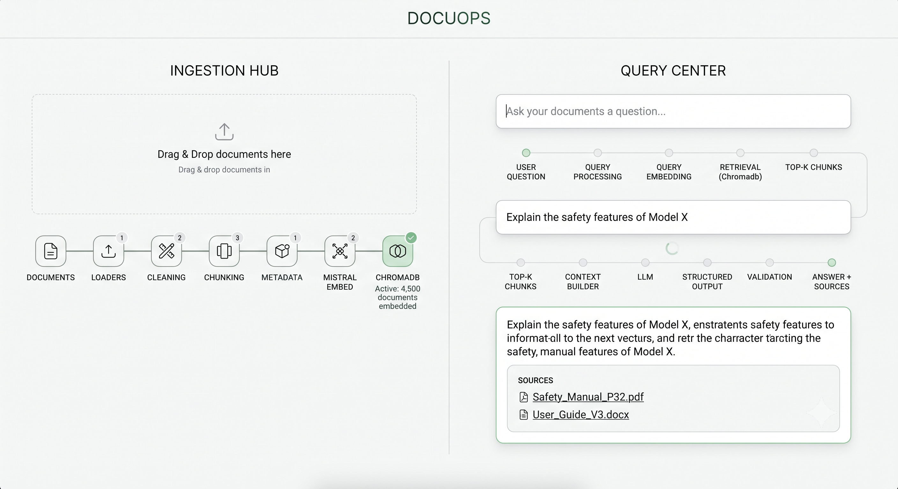
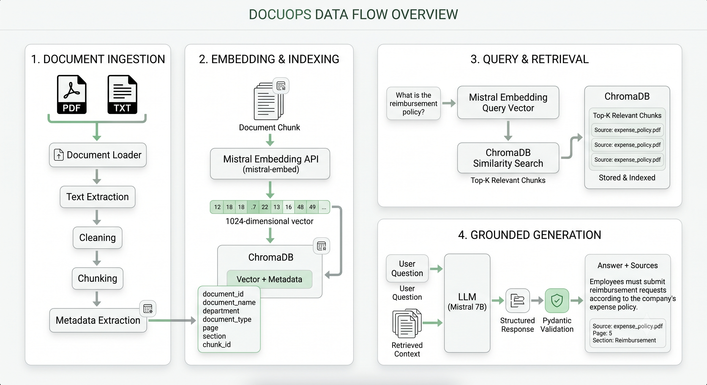
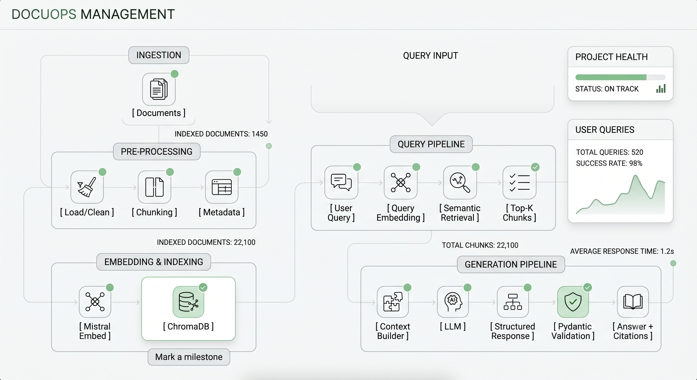

# DocuOps

### AI-Powered Enterprise Knowledge Assistant

DocuOps is an **enterprise RAG platform** that allows users to query organizational documents and receive **grounded answers with source attribution**.

Instead of simply connecting an LLM to a PDF, DocuOps builds a complete knowledge pipeline:

**Document Ingestion → Chunking → Embeddings → Vector Search → Retrieval → Grounded Generation → Structured Response**

---

## Why DocuOps?

Organizations store knowledge across:

- HR policies
- Engineering documentation
- Finance policies
- Product manuals
- Operations SOPs
- Internal FAQs

Finding information manually across hundreds of documents is slow and inefficient.

DocuOps allows employees to ask questions such as:

> "What is the reimbursement process?"

and receive an answer based only on the organization's indexed knowledge, along with the relevant document and source information.

---

## Key Features

- PDF / TXT document ingestion
- Intelligent text chunking
- Metadata-aware document processing
- Mistral `mistral-embed` embeddings
- ChromaDB vector storage
- Semantic Top-K retrieval
- Retrieval-Augmented Generation (RAG)
- Grounded answers
- Source attribution
- Structured LLM responses with Pydantic
- "I don't know" fallback for missing knowledge
- FastAPI REST API
- React-based knowledge assistant
- Basic RAG evaluation
- Retrieval and pipeline testing

---

# Architecture



---

# Data Flow

Each chunk retains useful metadata such as:

```text
document_id
document_name
department
document_type
page
section
chunk_id
```

DocuOps uses Mistral's `mistral-embed` model for text embeddings. The model produces 1024-dimensional vectors for text, which are suitable for semantic retrieval.

The important distinction is that the answer is **grounded in retrieved company knowledge** rather than generated from the model's general knowledge.

---

# Project Structure

```text
docuops/
│
├── README.md
├── .env.example
│
├── data/
│   └── documents/
│
├── backend/
│   └── app/
│       ├── main.py
│       ├── config.py
│       │
│       ├── ingestion/
│       │   ├── loader.py
│       │   ├── chunker.py
│       │   └── metadata.py
│       │
│       ├── embeddings/
│       │   └── mistral.py
│       │
│       ├── retrieval/
│       │   ├── vectorstore.py
│       │   ├── retriever.py
│       │   └── context.py
│       │
│       ├── generation/
│       │   ├── model.py
│       │   └── prompts.py
│       │
│       ├── schemas/
│       │   └── response.py
│       │
│       ├── pipelines/
│       │   ├── ingestion.py
│       │   └── rag.py
│       │
│       └── api/
│           └── routes/
│               ├── documents.py
│               └── chat.py
│
├── evaluation/
│   └── questions.json
│
├── tests/
│   ├── test_ingestion.py
│   ├── test_retrieval.py
│   └── test_rag.py
│
├── scripts/
│   └── ingest.py
│
└── frontend/ (currently working on...)
```

---

# Component Responsibilities

| Component | Responsibility |
|---|---|
| `ingestion` | Load, clean and prepare documents |
| `embeddings` | Convert text into semantic vectors |
| `vectorstore` | Store and search vectors |
| `retrieval` | Find relevant knowledge |
| `llm` | Generate grounded responses |
| `schemas` | Validate structured data |
| `pipelines` | Connect the complete workflows |
| `services` | Application/business logic |
| `api` | Expose functionality through REST |
| `evaluation` | Measure retrieval/RAG quality |
| `tests` | Verify system behavior |
| `frontend` | User-facing knowledge assistant |

---

# Tech Stack

### AI / RAG

- **Python**
- **LangChain**
- **Mistral Embeddings**
- **Pydantic**
- **ChromaDB**

Mistral's documentation specifically describes embeddings as a foundation for semantic search and RAG retrieval systems.

### Backend

- **FastAPI**
- **Uvicorn**
- REST APIs

FastAPI provides the API layer while keeping the RAG pipeline separate from HTTP route handling.

### Frontend

- **React**
- **Tailwind CSS**

### Development

- **uv**
- **Git**
- **GitHub**
- **pytest**
- `.env`

---

# Core RAG Pipeline


<!-- 
---

# API

### Upload Document

```http
POST /documents/upload
```

Uploads and indexes a document.

### List Documents

```http
GET /documents
```

Returns indexed documents.

### Delete Document

```http
DELETE /documents/{document_id}
```

Removes a document from the knowledge base.

### Ask Knowledge Base

```http
POST /chat
```

Example request:

```json
{
  "query": "What is the reimbursement policy?"
}
```

Example response:

```json
{
  "answer": "Employees can claim reimbursement according to the expense policy.",
  "grounded": true,
  "sources": [
    {
      "document": "expense_policy.pdf",
      "page": 5,
      "section": "Reimbursement"
    }
  ]
}
```

---

# Grounding & Hallucination Protection

DocuOps does not intentionally rely on the LLM's general knowledge for enterprise-specific answers.

The generation pipeline follows:

```text
Question
   +
Retrieved Company Knowledge
   ↓
     LLM
   ↓
Grounded Answer
```

If relevant information is unavailable:

```text
grounded = false
sources = []
```

The system should respond that the information could not be found rather than fabricate company policy.

---

# RAG Evaluation

A small evaluation dataset is maintained to test retrieval quality.

```text
Question
   ↓
Expected Document
   ↓
Expected Section
   ↓
Retrieved Results
   ↓
Evaluation
```

Metrics can include:

- Retrieval Accuracy
- Top-K Recall
- Source Correctness
- Groundedness

The goal is to measure the **retrieval system**, not simply demonstrate that an LLM can generate text.

---

# Future Improvements

The initial version focuses on a reliable RAG pipeline.

Possible future improvements:

- Hybrid search
- Query rewriting
- Reranking
- Metadata filtering
- Conversational memory
- Document versioning
- Multi-tenant knowledge bases
- Authentication and authorization
- Observability
- RAG evaluation dashboards
- Agentic workflows

These are intentionally separated from the MVP so the core retrieval system remains understandable and testable.

---

# Security Considerations

Future production deployments should consider:

- API key protection
- Document access control
- Tenant isolation
- Prompt injection
- Sensitive document handling
- Unauthorized retrieval
- Document-level permissions

---

# Project Philosophy

DocuOps is designed around one principle:

> **Retrieve the right knowledge first, then generate the answer.**

The project therefore focuses on the complete AI engineering pipeline rather than simply connecting an LLM to a chat interface.

---

# Learning Goals

This project demonstrates practical understanding of:

```text
Document Processing
        ↓
Chunking
        ↓
Embeddings
        ↓
Vector Databases
        ↓
Semantic Retrieval
        ↓
RAG
        ↓
Grounded Generation
        ↓
Structured Outputs
        ↓
API Architecture
        ↓
Evaluation
```

--- -->

# Status

🚧 **Under Development (two more days)**

